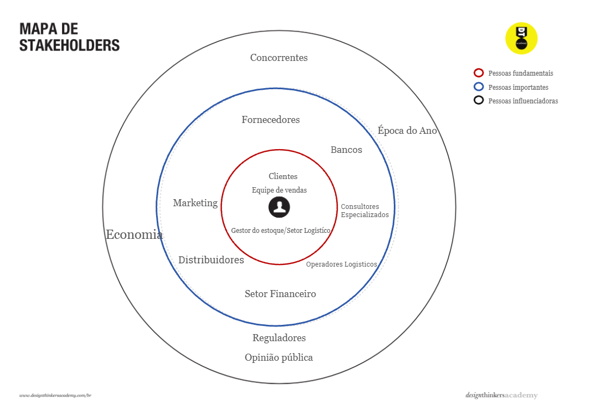
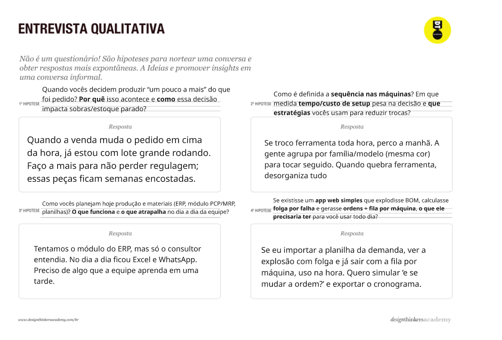
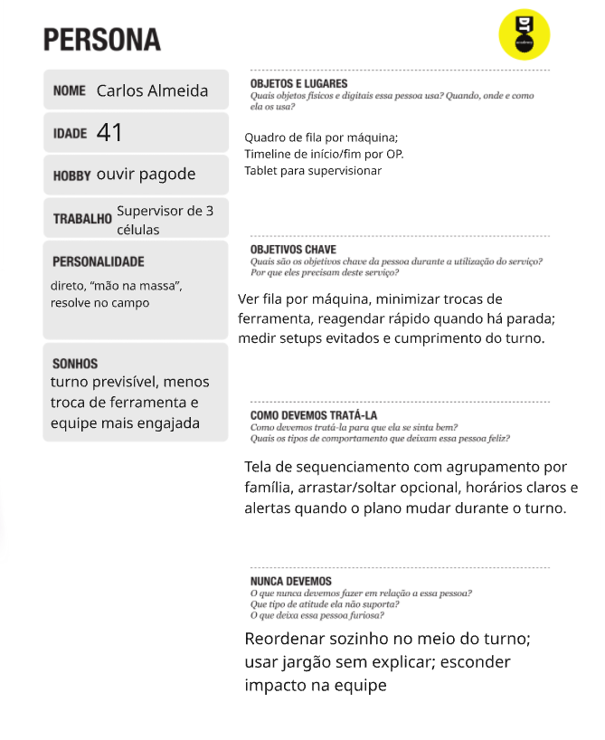
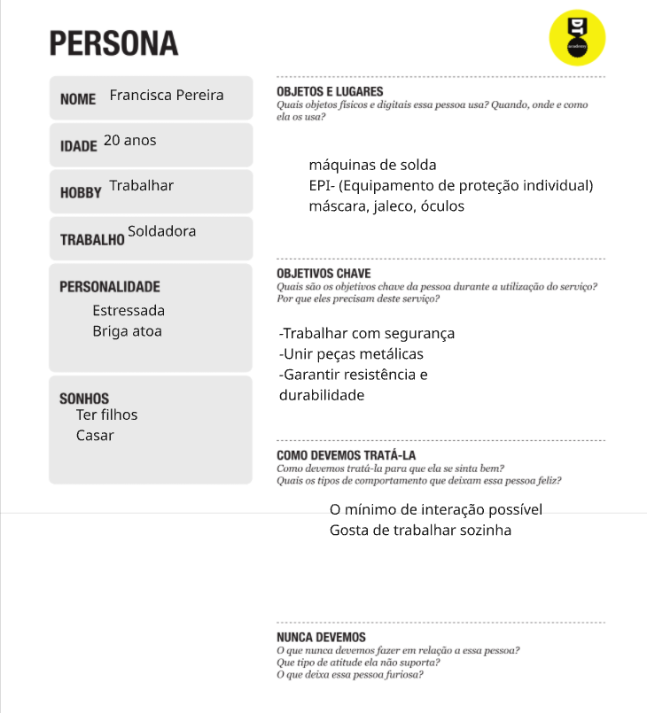
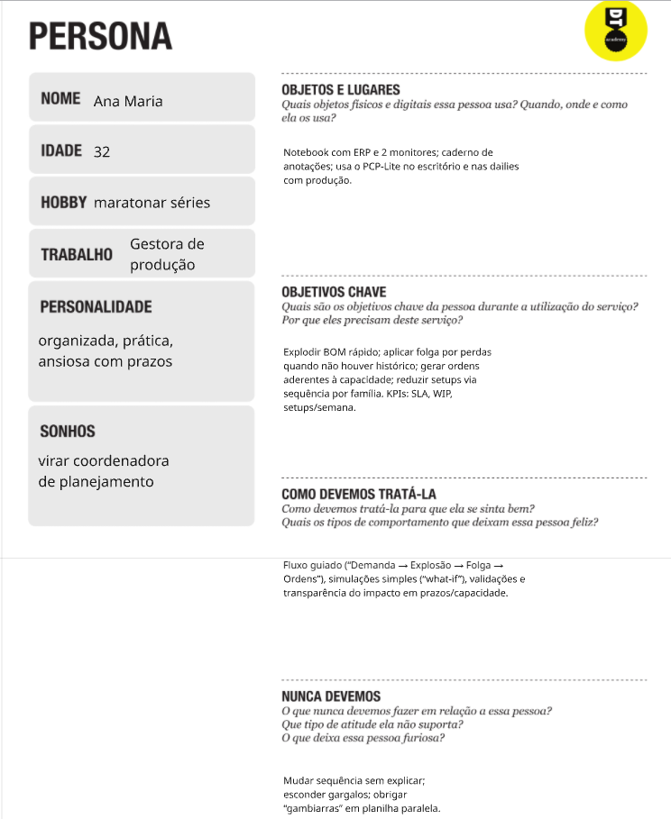
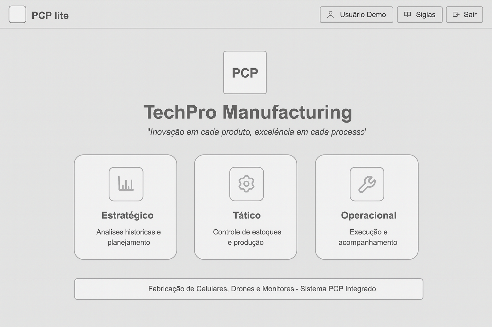
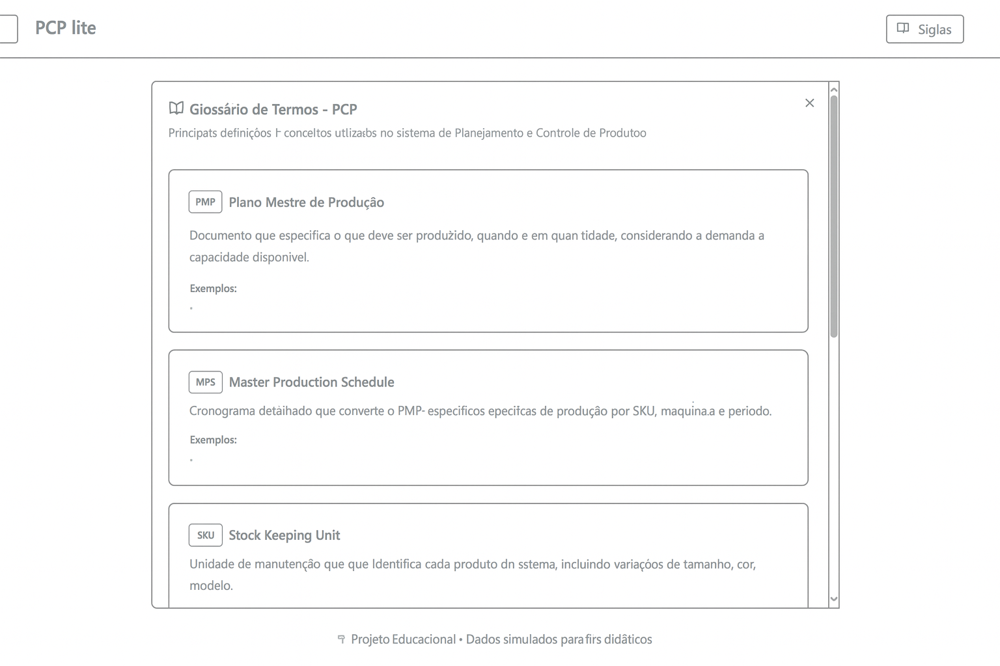
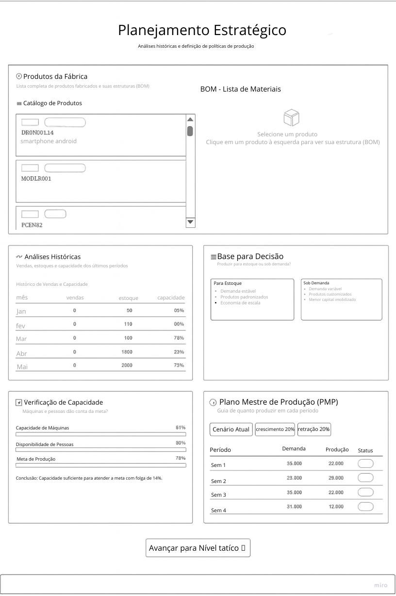
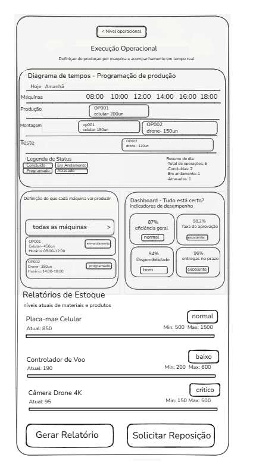
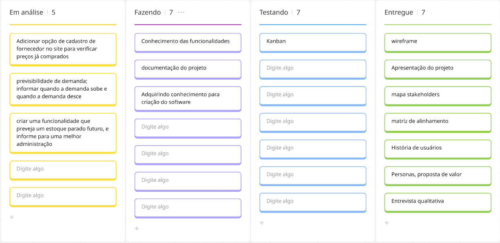

# Introdução

Informações básicas do projeto.

- **Projeto:** ***PCP Light***
- **Repositório GitHub:** [Link Repositorio](https://github.com/ICEI-PUC-Minas-PMGES-TI/pmg-es-2025-2-ti1-2010100-tiaw-estoqueparado.git)
- **Membros da equipe:** 

  - [João Francisco Ramos Murilo](https://github.com/joaofr-tech)
  - [Matheus Nicoli Andrade Coelho](https://github.com/matheusnNicoli)
  - [Thiago Nobre](https://github.com/Thiagono12)
  - [Christiano Gonçalves Araújo](https://github.com/ChrisGonnara)️
  - [Charles Henrique de Paula Santos](https://github.com/CharlesHPS)
  - [Bernardo Belini Vale](https://github.com/bbelini)
 


*A documentação do projeto é estruturada da seguinte forma:*

1. Introdução
2. [Contexto do Projeto](#contexto-do-projeto)
3. [Product Discovery](#product-discovery)
4. [Product Design](#product-design)
5. [Metodologia](#metodologia)
6. [Solução](#solução-implementada)
7. [Referências Bibliográficas](#referências)

✅ [Documentação de Design Thinking (MIRO)](files/processo-dt.pdf)

# Contexto do Projeto

## 1.1. Problema

  O acúmulo de estoque parado é um desafio crítico para empresas de diversos setores, representando um obstáculo direto à eficiência operacional e à saúde financeira do negócio. Este problema se manifesta quando produtos permanecem armazenados por longos períodos, sem giro de vendas, o que desencadeia uma série de consequências negativas.

  Do ponto de vista financeiro, o estoque estagnado equivale a capital imobilizado que deixa de ser investido em áreas estratégicas, como inovação, marketing ou expansão, comprometendo o fluxo de caixa. Além disso, há o risco constante de depreciação, obsolescência ou deterioração dos produtos, o que pode resultar em perdas diretas e na necessidade de liquidações com descontos agressivos, corroendo as margens de lucro.

  Operacionalmente, a manutenção de itens parados gera custos contínuos de armazenamento, seguro e segurança, além de ocupar um espaço físico valioso que poderia ser utilizado para mercadorias de maior demanda. Comercialmente, a presença de produtos obsoletos pode afetar a percepção da marca pelo consumidor e limitar a capacidade da empresa de se adaptar às novas tendências de mercado.

  Concluindo, a má gestão de inventário que leva ao estoque parado impacta negativamente a liquidez, a lucratividade e a competitividade da empresa, tornando-se um problema central a ser resolvido para garantir a sustentabilidade do negócio.

## 1.2. Objetivo do Projeto

**Objetivo Geral:** Desenvolver uma aplicação web robusta para o controle e gerenciamento de inventário, utilizando métodos de Planejamento e Controle da Produção (PCP) com foco na prevenção da formação de estoque parado.

**Objetivos Específicos:** Para alcançar o objetivo geral, o desenvolvimento será guiado pelos seguintes focos de aprofundamento, que unem tecnologia e usabilidade para criar uma solução prática e orientada a resultados:

1. **Desenvolver um módulo de análise preditiva para gestão de estoque:** Criar um sistema que utilize dados históricos e algoritmos de inteligência artificial para prever com maior acurácia as necessidades de materiais e produtos. Este módulo ajustará dinamicamente as sugestões de níveis de estoque com base na demanda prevista, visando reduzir o desperdício, evitar o excesso de compras e garantir que itens obsoletos ou de baixa saída sejam identificados proativamente.

2. **Implementar dashboards interativos com alertas e relatórios em tempo real:** Desenvolver um painel de controle centralizado que forneça uma visão clara e segura sobre indicadores chave, como saldo de estoque, itens com risco de se tornarem parados, datas de validade e fluxo de entrada e saída. A ferramenta emitirá alertas automáticos para que os gestores tomem ações preventivas, potencializando a tomada de decisão estratégica e integrando as áreas de compras, produção e comercial.

## 1.3. Justificativa

  Em um cenário de mercado cada vez mais competitivo e dinâmico, a otimização de recursos deixou de ser um diferencial para se tornar um requisito de sobrevivência. O problema do estoque parado é uma das principais fontes de ineficiência e perda de capital para as empresas. A abordagem tradicional de gerenciamento de inventário, é insuficiente para lidar com as flutuações de demanda e a complexidade das cadeias de suprimentos modernas.

  A motivação para este projeto reside na necessidade de transformar a gestão de estoque de um processo reativo para um modelo proativo e inteligente. A aplicação de métodos de Planejamento e Controle da Produção (PCP), oferece uma solução robusta para antecipar problemas e otimizar o fluxo de mercadorias.

A escolha dos objetivos específicos se justifica da seguinte forma:

O **desenvolvimento de um módulo de análise preditiva** ataca a raiz do problema. Em vez de simplesmente contar o que há no estoque, a ferramenta usará dados para prever o que será necessário, permitindo que as decisões de compra e produção sejam muito mais assertivas. Isso representa um avanço tecnológico significativo em relação aos sistemas de controle convencionais, alinhando o inventário diretamente à demanda futura.

A **implementação de dashboards interativos e alertas em tempo real** visa democratizar o acesso à informação e capacitar os gestores para a tomada de ágil de decisões. De nada adianta ter dados complexos se eles não forem facilmente visualizáveis e acionáveis. Os painéis transformarão dados brutos em insights claros, enquanto os alertas atuarão como um sistema de vigilância ativo, notificando os responsáveis antes que um item se torne um problema financeiro, garantindo que a gestão seja dinâmica e contínua.

  Portanto, este projeto se justifica por oferecer uma solução tecnológica que não apenas resolve um problema financeiro e operacional crítico, mas também proporciona uma vantagem competitiva duradoura às empresas, permitindo-lhes operar com maior inteligência, agilidade e lucratividade.

## 1.4. Público-alvo

  A solução foi desenhada para atender a diferentes perfis de profissionais dentro de uma empresa, que possuem responsabilidades e necessidades distintas em relação à gestão de inventário. O público-alvo pode ser segmentado em três grupos principais:

### 1. Perfil Operacional (Gestores de Estoque e Logística):

**Descrição:** São os profissionais que estão na linha de frente, responsáveis diretos pela organização física, controle de entradas e saídas e pela acuracidade do inventário. Geralmente, possuem bom conhecimento prático dos processos do armazém, mas podem ter um nível de familiaridade com tecnologia que varia do básico ao intermediário, estando habituados ao uso de planilhas e sistemas de gestão (ERP) mais antigos.

**Necessidades:** Precisam de uma ferramenta visual e intuitiva que simplifique sua rotina. Buscam por alertas claros sobre produtos sem giro, facilidade para localizar itens e relatórios simples que ajudem a identificar gargalos operacionais sem a necessidade de análises complexas.

2. Perfil Tático/Analítico (Analistas de Compras e Planejamento - PCP):

    Descrição: Este grupo tem um perfil mais analítico e é responsável por tomar decisões estratégicas de médio prazo, como definir o que, quando e quanto comprar ou produzir. Possuem maior familiaridade com a análise de dados e buscam ferramentas que ofereçam segurança e precisão para suas previsões.

    Necessidades: Valorizam funcionalidades como a análise preditiva, que os ajuda a antecipar a demanda futura com base em dados históricos. Precisam de dashboards detalhados que permitam cruzar informações de vendas, sazonalidade e níveis de estoque para otimizar as ordens de compra e produção.

3. Perfil Estratégico (Diretores, Gerentes Financeiros e Donos de Empresas):

    Descrição: São os tomadores de decisão de alto nível, focados na saúde financeira e na competitividade do negócio. Não têm tempo para se aprofundar em detalhes operacionais, mas precisam de uma visão macro e consolidada do desempenho do estoque.

    Necessidades: Buscam painéis de controle (dashboards) executivos que traduzam os dados do estoque em indicadores financeiros claros, como o valor total imobilizado em produtos parados, o custo de manutenção do inventário e o impacto no fluxo de caixa. Para eles, a ferramenta deve ser um termômetro rápido e confiável da eficiência da gestão de capital de giro da empresa.


# Product Discovery

## Etapa de Entendimento

### Matriz de Alinhamento (CSD)

  A Matriz de Alinhamento, também conhecida como Matriz CSD (Certezas, Suposições e Dúvidas), é uma ferramenta fundamental do Design Thinking que nos permite organizar e estruturar o conhecimento sobre o problema do estoque parado. Esta matriz nos ajuda a identificar o que sabemos com certeza, o que assumimos como verdadeiro e quais são nossas principais dúvidas que precisam ser investigadas.


#### Análise da Matriz CSD

**Certezas (O que já sabemos):**
- Atrasos logísticos e falta de monitoramento são problemas reais
- Compras em volumes maiores que a demanda real geram estoque parado
- Falhas de comunicação entre setores impactam o controle de estoque
- 25% do PIB brasileiro está imobilizado em estoque
- Estoque parado é advindo de uma compra maior do que a demanda real
- Pode comprometer o faturamento mensal e saúde financeira

**Suposições (O que achamos, mas não temos certeza):**
- Indústrias de moda, tecnologia e alimentos são mais vulneráveis ao estoque parado
- A implementação de tecnologia é cara demais para pequenas empresas
- Crises econômicas aumentam significativamente o problema
- Regiões Norte e Centro-Oeste têm desafios específicos devido à distância e infraestrutura
- Combos, descontos e promoções podem ser uma solução para evitar prejuízo

**Dúvidas (O que ainda não sabemos):**
- Como micro e pequenas empresas lidam diferentemente do problema?
- Qual o ROI de investir em sistemas de gestão de estoque?
- Como as empresas definem o que é "estoque parado" em termos de tempo?
- Como o estoque parado afeta o relacionamento com fornecedores?
- É uma falha na previsão do comportamento do cliente?
- Estoque parado imobiliza capital de giro das empresas?
- Para quais casos nossa solução seria melhor que usar ERP de uma grande empresa?
- Quais são as principais resistências para implementar soluções?

### Mapa de Stakeholders

  O Mapa de Stakeholders nos permite identificar e compreender todos os atores envolvidos no ecossistema do problema de estoque parado, desde os diretamente afetados até aqueles que podem influenciar ou ser influenciados pela solução.



#### Análise dos Stakeholders

**Pessoas Fundamentais (Centro - Vermelho):**
- **Clientes**: Equipe de vendas que lida diretamente com o problema
- **Gestor do estoque/Setor Logístico**: Responsável direto pelo controle e monitoramento
- **Consultores Especializados**: Profissionais que podem orientar na implementação de soluções

**Pessoas Importantes (Círculo Azul):**
- **Fornecedores**: Impactam diretamente na formação do estoque
- **Bancos**: Afetados pelo capital imobilizado e fluxo de caixa
- **Distribuidores**: Parte da cadeia logística
- **Marketing**: Responsável por estratégias de escoamento
- **Setor Financeiro**: Monitora impactos financeiros
- **Operadores Logísticos**: Executam a movimentação física

**Pessoas Influenciadoras (Círculo Externo - Preto):**
- **Concorrentes**: Influenciam dinâmica de mercado
- **Época do Ano**: Sazonalidade afeta demanda
- **Economia**: Contexto econômico geral
- **Reguladores**: Normas e regulamentações
- **Opinião pública**: Percepção do consumidor

### Entrevistas Qualitativas

  As entrevistas qualitativas foram conduzidas para validar nossas suposições e obter insights profundos sobre como os profissionais lidam na prática com o problema de estoque parado.

*Entrevista 1*

*Entrevista 2*

*Entrevista 3*


#### Principais Insights das Entrevistas

**Sobre Decisões de Produção:**
- **Pergunta**: "Quando vocês decidem produzir 'um pouco a mais' do que foi pedido? Por que isso acontece e como essa decisão impacta sobras/estoque parado?"
- **Resposta**: "Quando a venda muda o pedido em cima da hora, já estou com lote grande rodando. Faço a mais para não perder regulagem; essas peças ficam semanas encostadas."

**Sobre Planejamento e Sistemas:**
- **Pergunta**: "Como vocês planejam hoje produção e materiais (ERP, módulo PCP/MRP, planilhas)? O que funciona e o que atrapalha no dia a dia da equipe?"
- **Resposta**: "Tentamos o módulo do ERP, mas só o consultor entendia. No dia a dia ficou Excel e WhatsApp. Preciso de algo que a equipe aprenda em uma tarde."

**Sobre Sequenciamento de Produção:**
- **Pergunta**: "Como é definida a sequência nas máquinas? Em que medida tempo/custo de setup pesa na decisão e que estratégias vocês usam para reduzir trocas?"
- **Resposta**: "Se troco ferramenta toda hora, perco a manhã. A gente agrupa por família/modelo (mesma cor) para tocar seguido. Quando quebra ferramenta, desorganiza tudo."

**Sobre Ferramentas Digitais:**
- **Pergunta**: "Se existisse um app web simples que explodisse BOM, calculasse folga por falha e gerasse ordens + fila por máquina, o que ele precisaria ter para você usar todo dia?"
- **Resposta**: "Se eu importar a planilha da demanda, ver a explosão com folga e já sair com a fila por máquina, uso na hora. Quero simular 'e se mudar a ordem?' e exportar o cronograma."

## Etapa de Definição

### Personas

  As personas representam os usuários-chave identificados durante nossa pesquisa, cada uma com necessidades específicas relacionadas ao controle de estoque e gestão de produção.

#### Persona 1: Carlos Almeida - Supervisor de Produção




#### Persona 2: Francisca Pereira - Operadora de Produção




#### Persona 3: Ana Maria - Gestora de Produção




# Product Design

  Após a fase de descoberta e validação, entramos no Processo de Product Design. Este é o momento em que transformamos os aprendizados e os insights sobre as dores dos nossos usuários em uma solução tangível e de fácil utilização. Esta etapa se concentra em traduzir as necessidades identificadas em funcionalidades concretas.

  O processo começa com a definição das Histórias de Usuário para garantir que cada funcionalidade agregue valor a personas específicas. Em seguida, consolidamos nossa Proposta de Valor e detalhamos os Requisitos do projeto. Por fim, materializamos a interface e a experiência do usuário através da criação de fluxos de navegação, wireframes e, finalmente, um protótipo interativo que simula a usabilidade da aplicação final.

## Histórias de Usuários

| ID   | EU COMO...`PERSONA` | QUERO/PRECISO ...`FUNCIONALIDADE`      | PARA ...`MOTIVO/VALOR`                 |
| ---- | ------------------- | -------------------------------------- | -------------------------------------- |
| US01 | Gerente             | Ter maior controle sobre minha produção | Diminuir perdas e aumentar os lucros   |
| US02 | Vendedor            | Feedback dos clientes                   | Proporcionar melhor atendimento        |
| US03 | Gerente de estoque  | Ter mais informações sobre o estoque    | Utilizar todo o estoque e aumentar os ganhos |
| US04 | Head de vendas      | Melhorar as estratégias de vendas       | Aumentar o faturamento                 |
| US05 | Fornecedor          | Saber quando meu estoque está parado e quantidades | Poder liquidá-los e minimizar o prejuízo |
| US06 | Cliente             | Receber avisos de promoções e descontos | Pagar menos                            |


## Proposta de Valor


## Projeto de Interface

  Esta seção é dedicada à materialização visual e interativa da nossa solução. Aqui, apresentamos os artefatos de design que transformam os requisitos e as histórias de usuário em uma experiência concreta. O foco é detalhar a jornada do usuário, a arquitetura da informação e o layout de cada tela, com o objetivo de construir uma interface que seja não apenas funcional, mas também intuitiva e eficiente para todos os perfis de público-alvo definidos.

### Wireframes











##

### User Flow


### Protótipo Interativo

**✳️✳️✳️ COLOQUE AQUI UM IFRAME COM SEU PROTÓTIPO INTERATIVO ✳️✳️✳️**

✅ [Protótipo Interativo (MarvelApp)](https://marvelapp.com/prototype/ag72i6i)

# Metodologia

  A organização do grupo se deu de forma colaborativa, em um modelo próximo ao Scrum, mas sem a definição rígida de papéis fixos. As responsabilidades eram distribuídas de acordo com as necessidades de cada etapa, permitindo que todos participassem ativamente nas diferentes funções. As decisões foram tomadas de forma conjunta, em reuniões curtas apos as aulas.

## Ferramentas

Quanto ao ferramental, utilizamos Miro, GitHub, VsCode, Discord e Whatzapp para organizar tarefas, compartilhar documentos e acompanhar o progresso, mantendo a visibilidade do andamento do projeto para todos os membros.

| Ambiente                    | Plataforma    | Link de acesso                                |
| --------------------------- | ------------- | --------------------------------------------- |
| Processo de Design Thinking | Miro          | [miro](https://miro.com/app/board/uXjVJOYES7k=/)|
| Repositório de código       | GitHub        | [github](https://github.com/ICEI-PUC-Minas-PMGES-TI/pmg-es-2025-2-ti1-2010100-tiaw-estoqueparado/tree/master)|
| Protótipo Interativo        | MarvelApp     | https://marvelapp.com/prototype/ag72i6i       |
| Comunicação entre a equipe  | Discord       | https://discord.com/                          |
| Desenvolvimento             | Visual Studio | https://code.visualstudio.com/                |

## Gerenciamento do Projeto

Divisão de papéis no grupo e apresentação da estrutura da ferramenta de controle de tarefas (Kanban).




# Solução Implementada

Esta seção apresenta todos os detalhes da solução criada no projeto.

## Vídeo do Projeto

https://drive.google.com/file/d/1pAclT4o714TiJd1Dgs9jg6K1m9M1JhY8/view

## Funcionalidades

Esta seção apresenta as funcionalidades reais da aplicação.

##### Login de Usuários


Valida credenciais no serviço `usuarios` e registra `usuarioAutenticado` em `localStorage`. O cabeçalho e o menu usam esse estado para exibir o nome do usuário e controlar a navegação, com redirecionamento para `index.html` após o login.

Estrutura de dados (JSON Server):

```json
{
  "usuarios": [
    {
      "id": "1",
      "usuario": "admin",
      "senha": "admin123",
      "nome": "Admin PCP"
    }
  ]
}
```

##### Cadastro de Usuários


Permite criar conta com nome, usuário e senha. Os dados são validados, o sistema evita duplicidade consultando `GET /usuarios?usuario=[valor]`, envia `POST /usuarios` para persistir o novo registro, grava `usuarioAutenticado` em `localStorage` e redireciona para `index.html`.

Estrutura de dados (JSON Server):

```json
{
  "usuarios": [
    {
      "id": "1",
      "usuario": "admin",
      "senha": "admin123",
      "nome": "Admin PCP"
    }
  ]
}
```

##### Máquinas (Operacional)


Permite cadastrar, editar e excluir máquinas de produção. Os dados são sincronizados com o servidor usando `GET/POST/PUT/DELETE`, e a lista é atualizada dinamicamente por meio de formulários e modais.

Estrutura de dados (JSON Server):

```json
{
  "maquinas": [
    {
      "id": "2",
      "nome": "Pick & Place 01",
      "linha": "Pick & Place",
      "status": "operando",
      "horario": "08:00-12:00"
    }
  ]
}
```

##### Lotes de Produção 


Permite cadastrar lotes, programar a `dataInicio`, liberar para produção e excluir. As operações atualizam `status` e `dataInicio` no servidor e a interface reflete essas mudanças imediatamente.

Estrutura de dados (JSON Server):

```json
{
  "lotes": [
    {
      "id": "f8b4",
      "produto": "Celular",
      "quantidade": 23,
      "linha": "Linha SMT",
      "status": "em produção",
      "dataInicio": null
    }
  ]
}
```

##### Produtos e BOM


O catálogo lista produtos de `produtos-B_O_M` e a BOM vinculada por `codigoProduto` em `B_O_M`. Ao salvar, a página cria ou atualiza a BOM conforme a existência prévia; o custo total é calculado no cliente somando `custo * qtd`.

Estrutura de dados (JSON Server):

```json
{
  "produtos-B_O_M": [
    {
      "id": "2",
      "codigo": "DRONE001",
      "nome": "Drone Vision Pro",
      "categoria": "Drone",
      "preco": 4599,
      "leadtime": 15
    }
  ],
  "B_O_M": [
    {
      "id": 1,
      "codigoProduto": "CELL001",
      "materiais": [
        {
          "codigo": "PCB001",
          "nome": "Placa-mãe Celular",
          "qtd": 1,
          "custo": 285.5
        },
        {
          "codigo": "BAT001",
          "nome": "Bateria Li-ion 4000mAh",
          "qtd": 1,
          "custo": 85
        }
      ]
    }
  ]
}
```

##### Análises de Estoque 


Exibe gráficos de linha com o histórico de estoque por produto e atualiza simultaneamente a tabela de períodos. Os dados são carregados do recurso `produtos` e o gráfico é renderizado com Chart.js. O relatório consolida os itens visuais da página em uma lista com nome, nível atual, limites e status.

Estrutura de dados (JSON Server):

```json
{
  "produtos": [
    {
      "id": "placa-mae",
      "nome": "Placa-mãe Celular",
      "historico": [
        { "periodo": "1º Tri", "vendas": 100, "estoque": 850, "capacidade": 80 },
        { "periodo": "2º Tri", "vendas": 120, "estoque": 700, "capacidade": 75 }
      ]
    }
  ]
}
```

##### Metas de Produção 


Lista e filtra metas por ano e mês usando parâmetros de consulta. A tabela mostra período, demanda e produção com o status destacado. Os modais permitem criar, editar e deletar metas com sincronização via `POST`, `PUT` e `DELETE`.

Estrutura de dados (JSON Server):

```json
{
  "producao": [
    {
      "id": 10,
      "nome": "Meta Fevereiro",
      "ano": 2025,
      "mes": "Fev",
      "periodo_inicio": "01/02/2025",
      "periodo_final": "15/02/2025",
      "demanda": 120,
      "producao": 90,
      "status": "ok"
    }
  ]
}
```

##### Fluxo de Requisições

- Cada módulo usa `fetch` para acessar o JSON Server:
  - `GET` para carregar dados iniciais.
  - `POST` para cadastrar novos registros.
  - `PUT` para atualizar campos (`status`, `dataInicio`, etc.).
  - `DELETE` para excluir registros e sincronizar a interface.
- As páginas compartilham a sessão via `localStorage` (`usuarioAutenticado`), permitindo navegação e identificação do usuário entre telas.

## Módulos e APIs

Esta seção apresenta os módulos e APIs utilizados na solução.

| Propósito | Plataforma | Link |
| :-- | :-- | :-- |
| Interface | Bootstrap 5.3.8 | https://getbootstrap.com/ |
| Ícones | Material Symbols Outlined | https://fonts.google.com/icons |
| Gráficos | Chart.js | https://www.chartjs.org/ |
| Servidor de dados | JSON Server | http://localhost:3000/ |

APIs REST (JSON Server):

- Base `http://localhost:3000/`
  - `GET/POST/PUT/DELETE` `usuarios`
  - `GET/POST/PUT/DELETE` `maquinas`
  - `GET/POST/PUT/DELETE` `lotes`
  - `GET` `produtos`
  - `GET/POST/PUT/DELETE` `produtos-B_O_M`
  - `GET/POST/PUT/DELETE` `B_O_M`

# Referências

As referências utilizadas no trabalho foram:

- YouTube. YouTube, 2025. Disponível em: <https://www.youtube.com/>
- A Plataforma de Colaboração Visual para Todas as Equipes | Miro. Disponível em: <https://miro.com/pt/>.
- MARVEL. Marvel - The design platform for digital products. Disponível em: <https://marvelapp.com/>.
- PUC MINAS VIRTUAL. Canvas - PUC Minas. Disponível em: <https://canvas.pucminas.br/>. Acesso em: 2 out. 2025.
- MICROSOFT. Visual Studio Code. Disponível em: <https://code.visualstudio.com/>.
- DISCORD. Discord — A New Way to Chat with Friends & Communities. Disponível em: <https://discord.com/>.

